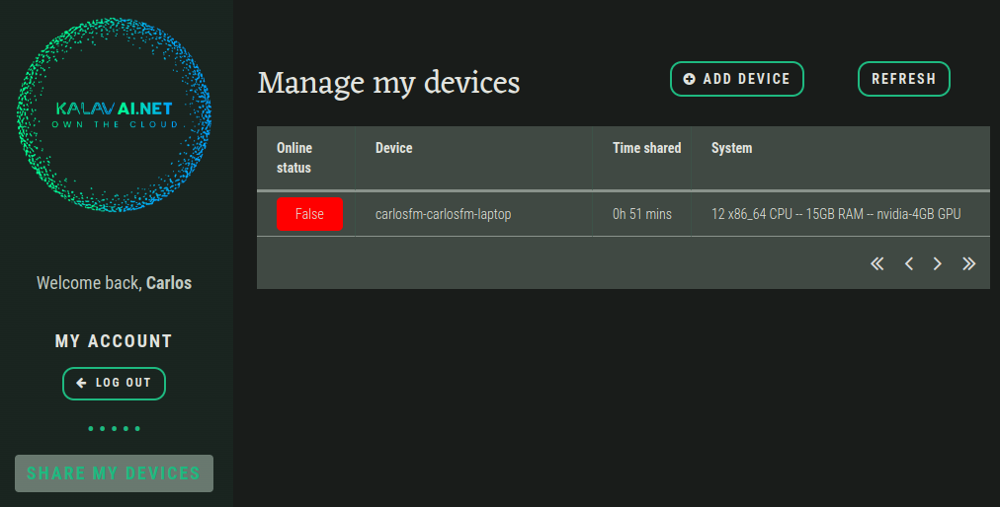

# Share your device

The Kalavai-client is an app that allows you to control when and how to share your device. To get started with sharing, you'll need your kalavai account credentials. Click below to create one. Then you are ready to install and run the kalavai-client, which will let you share your device's spare capacity with the world and earn!

[Create an account](https://platform.kalavai.net){ .md-button .md-button--primary}

## Technical requirements

The kalavai client app currently supports the following architectures:

- amd64
- x86_64

The following OS are supported:

- Linux (Debian, CentOS, SuSe, Ubuntu, Fedora, RedHat).

If your system is not currently supported, open an issue [here](https://github.com/kalavai-net/kalavai-client/issues) and request it. We are expanding this list constantly.


## Install (Linux)

To install the kalavai client app that allows you to share your device and earn, use the following installer:

```bash
curl -sfL https://raw.githubusercontent.com/kalavai-net/kalavai-client/main/scripts/install_client.sh | bash -
```

## Install (Windows)

[Coming soon!]


## Use kalavai-client

Once it's installed, run the CLI app with:

```bash
kalavai --help
```

```bash
usage: kalavai [-h] command ...

positional arguments:
  command
    login     Login with your Kalavai user email and password. Get an account from https://platform.kalavai.net
    logout    Logout from your kalavai user account.
    start     Join Kalavai cluster and start/resume sharing resources.
    status    Check the current status of your device.
    stop      Stop sharing your device and clean up. DO THIS ONLY IF YOU WANT TO REMOVE KALAVAI-CLIENT from your device.
    pause     Pause sharing your device and make your device unavailable for kalavai scheduling.

options:
  -h, --help  show this help message and exit
```

To start sharing your device, log in with the client and start sharing:

```bash
kalavai login --useremail your@email.address --password your-password
kalavai start
```


This will start the sharing loop. Head over to your [online account](http://platform.kalavai.net) to see more details, by selecting `Share your device` option. All your devices will appear there, along with the shared time and specs.

